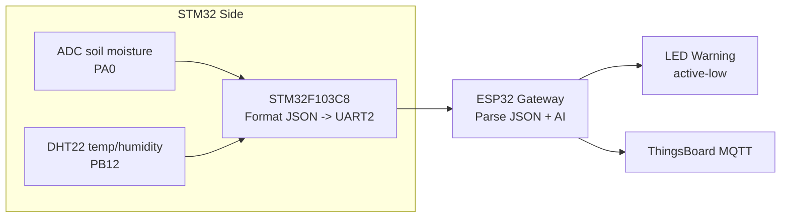
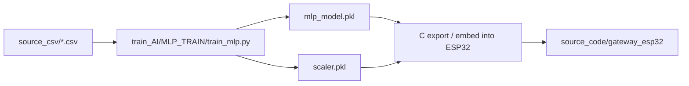

hãy nói yêu cầu cụ thể, tôi sẽ tiếp tục.
# SENSOR_NW_FINAL

Repo này là một hệ thống smart farming / sensor network gồm 2 firmware nhúng, pipeline huấn luyện machine learning và phần thiết kế mạch. Mục tiêu là đọc dữ liệu độ ẩm đất, nhiệt độ, độ ẩm không khí, đưa dữ liệu qua STM32 sang ESP32, chạy suy luận MLP tại gateway, rồi đẩy telemetry lên ThingsBoard để giám sát và cảnh báo.

## Tổng Quan

Luồng chạy thực tế của project hiện tại:

1. STM32 đọc cảm biến đất và DHT22.
2. STM32 đóng gói dữ liệu thành JSON và gửi qua UART2.
3. ESP32 nhận JSON qua `Serial2`, parse dữ liệu và gọi model MLP.
4. ESP32 quyết định bật hoặc tắt LED cảnh báo, đồng thời gửi telemetry lên ThingsBoard qua MQTT.
5. Mô hình MLP được train từ dữ liệu CSV trong `source_csv/` và có thể export sang C để nhúng vào ESP32.





## Cấu Trúc Thư Mục

```text
sensor_nw_final/
├── circuit_design/
│   └── lib/                     # Thư viện mạch Altium
├── documents/                   # Tài liệu liên quan ESP / MQTT
├── source_code/
│   ├── gateway_esp32/           # Firmware ESP32 Gateway
│   └── soil_dht22_stm32/        # Firmware STM32F103C8
├── source_csv/                  # Dataset CSV dùng để train / test
├── train_AI/                    # Script train và inspect model
├── README.md
└── note_sensor_nw_final.txt
```

### Nội Dung Từng Khu Vực

- `circuit_design/`: thư viện mạch cho ESP32 DevKit V1, STM32 Blue Pill và cảm biến DHT.
- `documents/`: tài liệu tham khảo theo nhóm chủ đề như ESP và MQTT.
- `source_code/`: toàn bộ firmware nhúng cho STM32 và ESP32.
- `source_csv/`: dữ liệu đầu vào để xây dựng mô hình học máy.
- `train_AI/`: script huấn luyện, đọc model và kiểm tra model.

## Phần Cứng Và Kết Nối

### STM32F103C8

Firmware STM32 trong `source_code/soil_dht22_stm32/` dùng các ngoại vi sau:

- `PA0`: ADC đọc độ ẩm đất.
- `PB12`: chân dữ liệu của DHT22.
- `USART1`: debug ra serial monitor.
- `USART2`: gửi JSON sang ESP32.
- `TIM2`: tạo delay microsecond cho giao tiếp DHT.

### ESP32 DevKit V1

Gateway ESP32 trong `source_code/gateway_esp32/` dùng:

- UART nhận dữ liệu từ STM32 qua `Serial2`.
- Wi-Fi để kết nối mạng.
- MQTT để gửi telemetry lên ThingsBoard.
- LED cảnh báo ở chân `GPIO13`.

### Kết Nối Logic

- STM32 gửi dữ liệu qua UART2 ở tốc độ `115200`.
- ESP32 đọc đúng từng dòng JSON kết thúc bằng ký tự xuống dòng.
- LED cảnh báo đang dùng logic active-low, tức là `LOW` sẽ bật LED và `HIGH` sẽ tắt LED.

## Firmware STM32

File chính: [source_code/soil_dht22_stm32/main_code.c](source_code/soil_dht22_stm32/main_code.c)

### Vai Trò

Firmware này là lớp thu thập dữ liệu đầu vào cho hệ thống AI. Nó đọc dữ liệu từ cảm biến đất và DHT22, sau đó đóng gói thành JSON để ESP32 xử lý tiếp.

### Luồng Xử Lý

1. Khởi tạo `UART2_Config()` để gửi dữ liệu sang ESP32.
2. Khởi tạo `UART1_Config()` để debug.
3. Khởi tạo `TIM2_Config()` để phục vụ delay chính xác.
4. Khởi tạo `DHT22_GPIO_Config()` và `ADC_Config()`.
5. Đọc độ ẩm đất bằng `Soil_Moisture_Percent()`.
6. Đọc DHT22 bằng `DHT22_Start()` và `DHT22_Read_Data()`.
7. Nếu dữ liệu hợp lệ, in ra debug và gửi JSON qua UART2.
8. Nếu DHT lỗi, gửi JSON lỗi `{"error":"dht"}` ra debug.

### Format Dữ Liệu Gửi Sang ESP32

JSON được tạo bởi hàm `UART2_SendJSON()` có dạng:

```json
{"temp":32.1,"hum":70.2,"soil":45}
```

Trong đó:

- `temp`: nhiệt độ môi trường.
- `hum`: độ ẩm không khí.
- `soil`: độ ẩm đất theo phần trăm.

### Chi Tiết Cảm Biến

- DHT22 được đọc theo kiểu bit-banging trên `PB12`.
- Driver hiện tại có kiểm tra checksum 5 byte.
- ADC đất lấy trung bình 10 mẫu để giảm nhiễu.
- Hàm quy đổi độ ẩm đất đang map ADC 12-bit sang phần trăm theo công thức tuyến tính.

### File Hỗ Trợ STM32

- [source_code/soil_dht22_stm32/lib/inc/uart.h](source_code/soil_dht22_stm32/lib/inc/uart.h)
- [source_code/soil_dht22_stm32/lib/src/uart.c](source_code/soil_dht22_stm32/lib/src/uart.c)
- [source_code/soil_dht22_stm32/lib/inc/dht22.h](source_code/soil_dht22_stm32/lib/inc/dht22.h)
- [source_code/soil_dht22_stm32/lib/src/dht22.c](source_code/soil_dht22_stm32/lib/src/dht22.c)
- [source_code/soil_dht22_stm32/lib/inc/adc_soil.h](source_code/soil_dht22_stm32/lib/inc/adc_soil.h)
- [source_code/soil_dht22_stm32/lib/src/adc_soil.c](source_code/soil_dht22_stm32/lib/src/adc_soil.c)

## Gateway ESP32

File chính: [source_code/gateway_esp32/src/main.cpp](source_code/gateway_esp32/src/main.cpp)

### Vai Trò

ESP32 là gateway trung tâm của hệ thống. Nó nhận JSON từ STM32, suy luận bằng model MLP, điều khiển LED cảnh báo và gửi telemetry lên ThingsBoard.

### Cấu Hình Build

File cấu hình: [source_code/gateway_esp32/platformio.ini](source_code/gateway_esp32/platformio.ini)

Các thông số chính:

- board: `esp32doit-devkit-v1`
- framework: `arduino`
- monitor speed: `115200`
- thư viện MQTT: `PubSubClient`
- thư viện JSON: `ArduinoJson` phiên bản 7.x

### Luồng Runtime

1. Kết nối Wi-Fi.
2. Kết nối MQTT đến ThingsBoard.
3. Lắng nghe dữ liệu từ `Serial2`.
4. Parse JSON và kiểm tra đủ 3 trường bắt buộc: `temp`, `hum`, `soil`.
5. Gọi `mlp_predict((float)soil, temp, hum)`.
6. Nếu prediction lớn hơn `0.0f`, hệ thống gán trạng thái `WARNING` và bật LED.
7. Nếu không, hệ thống gán trạng thái `NORMAL` và tắt LED.
8. Gửi telemetry sang ThingsBoard.

### Telemetry Gửi Lên ThingsBoard

Các field telemetry hiện tại gồm:

- `temperature`
- `humidity`
- `soil`
- `prediction`
- `ai_state`
- `led_state`
- `control_mode`
- `manual_state`

### Chế Độ Điều Khiển

Gateway đã có hỗ trợ RPC từ ThingsBoard để chuyển đổi chế độ điều khiển.

Các RPC method đang được xử lý:

- `setControlMode`: đổi giữa `AI` và `MANUAL`.
- `setManualState`: bật/tắt LED khi đang ở chế độ manual.
- `getControlMode`: trả về chế độ hiện tại.
- `getManualState`: trả về trạng thái LED manual.

Khi ở chế độ manual:

- `ON` sẽ kéo LED xuống `LOW`.
- `OFF` sẽ đưa LED về `HIGH`.

Khi ở chế độ AI:

- ESP32 đọc output từ model và quyết định trạng thái LED tự động.

### Model Nhúng Trên ESP32

Header model: [source_code/gateway_esp32/include/mlp_model.h](source_code/gateway_esp32/include/mlp_model.h)

Model C dùng hàm:

- `float mlp_predict(float soil, float temp, float hum);`
- `uint8_t mlp_classify(float soil, float temp, float hum);`

Những file model C thường được lưu trong `source_code/gateway_esp32/` để build cùng project. Khi thay model mới, cần giữ đồng bộ giữa header và source model.

## Pipeline Huấn Luyện MLP

Thư mục: [train_AI/MLP_TRAIN](train_AI/MLP_TRAIN)

### Mục Tiêu

Pipeline này dùng dữ liệu CSV để train mô hình MLP cho bài toán phân loại / ra quyết định tưới dựa trên 3 feature:

- `soil_moisture`
- `temperature`
- `humidity`

### File Chính

- [train_AI/MLP_TRAIN/train_mlp.py](train_AI/MLP_TRAIN/train_mlp.py): script train model.
- [train_AI/MLP_TRAIN/read_model.py](train_AI/MLP_TRAIN/read_model.py): đọc model và scaler.
- [train_AI/MLP_TRAIN/inspect_model.py](train_AI/MLP_TRAIN/inspect_model.py): kiểm tra chi tiết trọng số / bias / scaler.

### Dataset Đang Dùng

Script hiện tại đọc file `soil_data_ver3.csv` trong cùng thư mục train. Dữ liệu đầu vào phải có các cột:

- `soil_moisture`
- `temperature`
- `humidity`
- `label`

Lưu ý quan trọng: trong một số file CSV cũ có thể xuất hiện header `lable` thay vì `label`. Trước khi train, hãy đồng bộ lại tên cột để tránh lỗi đọc dữ liệu hoặc train sai nhãn.

### Các Bước Train Trong `train_mlp.py`

1. Đọc dữ liệu bằng `pandas`.
2. Xáo trộn dữ liệu với `random_state=42`.
3. Tách `X` và `y`.
4. Chia train/test theo tỷ lệ `80/20` với stratify.
5. Chuẩn hóa feature bằng `StandardScaler`.
6. Train `MLPClassifier` với cấu hình:
   - hidden layers: `(16, 8)`
   - activation: `tanh`
   - solver: `adam`
   - learning rate init: `0.001`
   - max_iter: `5000`
   - early_stopping: `True`
7. Đánh giá model bằng accuracy, classification report và confusion matrix.
8. Lưu model ra `mlp_model.pkl`.
9. Lưu scaler ra `scaler.pkl`.

### Ý Nghĩa Của `scaler.pkl`

Model MLP chỉ nên suy luận đúng khi dữ liệu đầu vào đã được chuẩn hóa giống lúc train. Vì vậy, khi deploy lên ESP32, phải giữ `scaler.pkl` hoặc tái hiện đúng logic scale trong firmware.

### Chức Năng Của `read_model.py`

Script này dùng để:

- nạp `mlp_model.pkl`.
- nạp `scaler.pkl`.
- in ra số lớp ẩn, activation.
- in weights và bias của từng layer.
- in mean và standard deviation của scaler.

### Chức Năng Của `inspect_model.py`

Script này phù hợp khi cần xem sâu hơn cấu trúc model, kiểm tra layer và xác minh rằng model đã train đúng cấu hình mong muốn trước khi export sang firmware.

## Hướng Dẫn Chạy Nhanh

### 1. Chuẩn Bị Python Environment

Trong folder train, cài các package cần thiết:

```bash
pip install pandas scikit-learn joblib
```

### 2. Train MLP

Chạy script train:

```bash
python train_AI/MLP_TRAIN/train_mlp.py
```

Sau khi train xong, bạn sẽ có:

- `mlp_model.pkl`
- `scaler.pkl`

### 3. Kiểm Tra Model

Nếu muốn in thông tin model và scaler:

```bash
python train_AI/MLP_TRAIN/read_model.py
```

### 4. Build STM32

Mở project `source_code/soil_dht22_stm32/` bằng Keil MDK hoặc toolchain tương thích STM32F1, sau đó build và flash lên board STM32F103C8.

### 5. Build ESP32

Mở [source_code/gateway_esp32/platformio.ini](source_code/gateway_esp32/platformio.ini) bằng VS Code + PlatformIO, rồi build / upload firmware ESP32.

### 6. Cập Nhật Thông Tin Kết Nối

Trước khi nạp thật, hãy thay các giá trị sau trong `main.cpp`:

- Wi-Fi SSID / password.
- ThingsBoard token.
- Nếu cần, chỉnh chân LED hoặc chân UART theo wiring thực tế.

## Gợi Ý Deploy End-To-End

1. Flash STM32 trước để kiểm tra dữ liệu serial debug và JSON UART2.
2. Mở Serial Monitor của ESP32 ở `115200` để xác nhận gateway nhận được JSON.
3. Nếu gateway báo `PARSE FAIL`, kiểm tra lại format JSON từ STM32.
4. Nếu AI luôn ra warning hoặc luôn normal, kiểm tra lại model, scaler và ngưỡng quyết định `prediction > 0.0f`.
5. Nếu ThingsBoard không nhận telemetry, kiểm tra token, server, topic MQTT và kết nối Wi-Fi.

## Lưu Ý Kỹ Thuật Quan Trọng

- Project đang có nhiều file artifact build trong `source_code/soil_dht22_stm32/Objects/` và `Listings/`. Các file này chỉ là output build, không phải source logic.
- Không nên commit thông tin đăng nhập Wi-Fi hoặc token thật vào README công khai.
- Gateway ESP32 phụ thuộc chặt vào format JSON mà STM32 gửi ra.
- Nếu sửa tên field trong JSON, phải sửa đồng bộ ở cả STM32 lẫn ESP32.
- Nếu thay dataset, cần kiểm tra lại tên cột `label` và thứ tự feature `soil_moisture`, `temperature`, `humidity`.

## Vấn Đề Thường Gặp

### 1. ESP32 Không Nhận Được Dữ Liệu Từ STM32

- Kiểm tra dây nối UART TX/RX.
- Kiểm tra chung GND giữa hai board.
- Kiểm tra tốc độ baud đang là `115200` ở cả hai phía.
- Đảm bảo JSON có ký tự xuống dòng kết thúc.

### 2. STM32 Báo Lỗi DHT

- Kiểm tra wiring của DHT22.
- Kiểm tra pull-up cho chân dữ liệu.
- Kiểm tra nguồn cấp và delay bit-banging.

### 3. Model Không Cho Kết Quả Như Mong Muốn

- Kiểm tra file CSV đầu vào.
- Kiểm tra `scaler.pkl` có đi kèm model hay không.
- Kiểm tra model export sang C có đúng hệ số và hàm kích hoạt.

### 4. ThingsBoard Không Có Telemetry

- Kiểm tra `TB_SERVER`, `TB_PORT`, `TB_TOKEN` trong ESP32.
- Kiểm tra topic `v1/devices/me/telemetry`.
- Kiểm tra Wi-Fi đã kết nối ổn định chưa.

## Tóm Tắt Ngắn Gọn Theo Chức Năng

- `source_code/soil_dht22_stm32/`: đọc cảm biến và xuất JSON.
- `source_code/gateway_esp32/`: nhận JSON, chạy MLP, điều khiển LED, gửi ThingsBoard.
- `train_AI/MLP_TRAIN/`: train model và inspect scaler / weights.
- `source_csv/`: dữ liệu để train.
- `circuit_design/`: thư viện mạch và tài nguyên thiết kế phần cứng.

## Nếu Bạn Muốn Mở Rộng Tiếp

Tôi có thể tiếp tục giúp bạn:

1. viết lại README theo phong cách ngắn gọn hơn cho GitHub.
2. bổ sung sơ đồ wiring chân nối STM32 với ESP32 và cảm biến.
3. chuẩn hóa lại phần train model để khớp hoàn toàn với firmware hiện tại.
4. thêm hướng dẫn export `mlp_model.pkl` sang `mlp_model.c` / `mlp_model.h`.
- input phải giữ đúng thứ tự `soil_moisture`, `temperature`, `humidity`

## Dữ liệu và điểm cần chú ý

### Dữ liệu đang có cột `lable`

Các file CSV nhãn hiện thấy header là:

```text
soil_moisture,temperature,humidity,lable
```

Nhưng cả 2 script train đang đọc cột `label`. Nếu bạn dùng đúng các file CSV hiện có thì cần sửa một trong hai bên cho khớp, nếu không training sẽ lỗi ngay lúc tách target.

### `source_csv/daily_temperature_extracted.csv`

File này chứa dữ liệu nhiệt độ theo ngày, ví dụ:

- `Date`
- `Daily_Min_C`
- `Daily_Max_C`

Nó phù hợp cho phân tích phụ trợ hoặc mở rộng feature, nhưng không phải input chính của luồng inference hiện tại.

## File sinh ra và artefact

Không nên nhầm các file build / model đã xuất với source chính.

### Trong firmware STM32

Các thư mục / file sau thường là artefact build của Keil/MDK:

- `Objects/`
- `Listings/`
- `DebugConfig/`
- `RTE/`
- `.axf`
- `.htm`
- `.lst`
- `.crf`
- `.d`
- `.dep`
- `.sct`

### Trong ML

Các file sau là artefact hoặc file deploy:

- `soil_model_dt.pkl`
- `mlp_model.pkl`
- `scaler.pkl`
- `mlp_model.c`
- `mlp_model.h`

## Cách đọc repo nhanh nhất

Nếu muốn nắm flow trong thời gian ngắn, nên đọc theo thứ tự:

1. [source_code/soil_moisture_dht11_stm32/main.c](source_code/soil_moisture_dht11_stm32/main.c)
2. [source_code/gateway_esp32/src/main.cpp](source_code/gateway_esp32/src/main.cpp)
3. [train_AI/MLP_TRAIN/train_mlp.py](train_AI/MLP_TRAIN/train_mlp.py)
4. [train_AI/Decision_Tree/train.py](train_AI/Decision_Tree/train.py)
5. [source_csv/Smart_Farming_Smart_Labeled.csv](source_csv/Smart_Farming_Smart_Labeled.csv)

## Tóm tắt ngắn

`sensor_nw_final` không phải một project đơn lẻ mà là chuỗi đầy đủ gồm:

- phần cứng và tài liệu thiết kế
- firmware STM32 đọc cảm biến
- gateway ESP32 xử lý AI và MQTT
- dataset CSV
- pipeline train Decision Tree và MLP

Nếu đi theo đúng flow trên, người đọc sẽ hiểu được dữ liệu đi từ cảm biến nào, qua firmware nào, model nào xử lý, và telemetry cuối cùng được đẩy đi đâu.

Điểm mạnh của cấu trúc hiện tại là đã có đủ các thành phần để triển khai end-to-end. Điểm cần chỉnh trước khi chạy lại là **đồng bộ tên cột dữ liệu**, **phân biệt source với artefact**, và **xác nhận đúng thư mục chạy script**.
