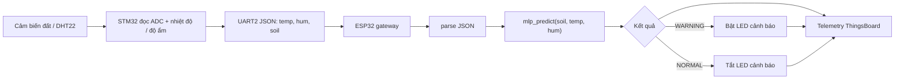
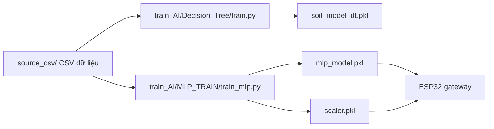

# SENSOR_NW_FINAL

Repo này là một hệ thống smart farming (mạng cảm biến) dùng STM32 và ESP32, kèm pipeline huấn luyện ML. Mục tiêu: thu thập dữ liệu đất/không khí, inference tại gateway ESP32 bằng model MLP, và đẩy telemetry lên ThingsBoard.

## Tóm tắt luồng dữ liệu





## Nội dung chính và các thư mục

- [source_csv](source_csv): dữ liệu nguồn và dữ liệu có gán nhãn.
- [train_AI](train_AI): pipeline huấn luyện (Decision Tree và MLP).
- [source_code](source_code): firmware STM32 và gateway ESP32.

Cấu trúc tổng quát:

```text
sensor_nw_final/
├── circuit_design/
├── documents/
├── source_code/
├── source_csv/
└── train_AI/
```

### Thiết kế phần cứng

Thư mục `circuit_design/` chứa thư viện mạch (ví dụ `DEVKIT_V1_ESP32-WROOM-32.IntLib`, `Stm32 Blue Pill.IntLib`). Đây là tài nguyên thiết kế, không phải code chạy.

### Dữ liệu

Thư mục `source_csv/` chứa các file CSV dùng cho huấn luyện và phân tích, ví dụ `Smart_Farming_Smart_Labeled.csv`.

Lưu ý: Một số file có header `lable` (thiếu 'e'). Các script huấn luyện kỳ vọng `label` — đồng bộ tên cột trước khi train.

### Huấn luyện ML

- Decision Tree: [train_AI/Decision_Tree/train.py](train_AI/Decision_Tree/train.py)
- MLP: [train_AI/MLP_TRAIN/train_mlp.py](train_AI/MLP_TRAIN/train_mlp.py)

MLP pipeline sẽ lưu `mlp_model.pkl` và `scaler.pkl` — khi deploy lên ESP32 cần export model sang C (có thư mục `source_code/gateway_esp32/prj_lib/mlp_model.*`).

### Gateway ESP32

File chính: [source_code/gateway_esp32/src/main.cpp](source_code/gateway_esp32/src/main.cpp)

Chức năng chính của gateway:
1. Kết nối Wi-Fi và MQTT/ThingsBoard.
2. Đọc JSON từ `Serial2` (STM32 gửi): `{"temp":...,"hum":...,"soil":...}`.
3. Parse dữ liệu, gọi `mlp_predict(soil, temp, hum)` và quyết định `WARNING`/`NORMAL`.
4. Bật/tắt LED cảnh báo và gửi telemetry.

Ghi chú kỹ thuật:
- LED cảnh báo sử dụng active-low (kiểm tra sơ đồ hoặc mã nguồn để xác nhận).
- ESP32 có file `include/mlp_model.h` và `prj_lib/mlp_model.c` chứa hàm `mlp_predict` nếu model được nhúng dưới dạng mã C.

### Firmware STM32

Các project firmware nằm trong `source_code/soil_moisture_stm32/` và `source_code/soil_moisture_dht11_stm32/`.

- `soil_moisture_stm32`: đọc ADC đất, in giá trị để debug.
- `soil_moisture_dht11_stm32`: đọc ADC đất + DHT (nhiệt độ/độ ẩm), gửi JSON qua UART2.

Ví dụ JSON gửi từ STM32:

```json
{"temp":32.1,"hum":70.2,"soil":45}
```

Nếu DHT đọc lỗi, firmware trả về: `{"error":"dht"}`.

### Lưu ý về naming và artefact

- Không commit các artefact build (thư mục `Objects/`, `Listings/`, file `.axf`, `.d`, ...).
- Các model và file deploy (`mlp_model.pkl`, `mlp_model.c`, `mlp_model.h`, `scaler.pkl`) nên tách rõ `deploy/` nếu cần.

## Hướng dẫn nhanh

1. Huấn luyện MLP (ví dụ):

```bash
python train_AI/MLP_TRAIN/train_mlp.py
```

2. Chuyển `mlp_model` sang code C (nếu cần) và copy vào `source_code/gateway_esp32/prj_lib/`.

3. Build và flash firmware STM32 bằng Keil/MDK hoặc toolchain tương ứng.

4. Build và flash ESP32 bằng PlatformIO (mở [source_code/gateway_esp32/platformio.ini](source_code/gateway_esp32/platformio.ini)).

## Các vấn đề thường gặp

- Mermaid trên GitHub/GitLab có thể lỗi khi label chứa dấu phẩy hoặc ký tự đặc biệt — hãy đặt label trong dấu nháy đôi như trong file này.
- Đồng bộ tên cột `label`/`lable` giữa CSV và script huấn luyện.
- Kiểm tra tốc độ `Serial` (115200) và format JSON giữa STM32 và ESP32.

## Muốn tôi làm thêm?

Nếu bạn muốn tôi:
- xuất `mlp_model` thành mã C (`mlp_model.c`/`mlp_model.h`),
- sửa script train để chấp nhận header `lable`,
- hoặc tạo hướng dẫn deploy chi tiết,

hãy nói yêu cầu cụ thể, tôi sẽ tiếp tục.


Đây là firmware dùng 2 nguồn dữ liệu:

- độ ẩm đất từ ADC `PA0`
- nhiệt độ / độ ẩm không khí từ cảm biến họ DHT trên `PB12`

Điểm cần nói rõ: tên thư mục là `dht11`, nhưng code hiện tại đang đọc theo format DHT22. Nếu phần cứng thực tế là DHT11 thì cần chỉnh lại phần đọc dữ liệu cho khớp.

Luồng xử lý:

1. Khởi tạo `USART1` để debug và `USART2` để gửi dữ liệu sang ESP32.
2. Khởi tạo `TIM2` để tạo delay chính xác cho giao tiếp bit-banging.
3. Đọc DHT trên `PB12`, kiểm tra checksum.
4. Đọc ADC đất và lấy trung bình 10 mẫu.
5. Nếu dữ liệu hợp lệ, in ra serial và gửi JSON qua UART2.

JSON được gửi sang gateway có dạng:

```json
{"temp":32.1,"hum":70.2,"soil":45}
```

Nếu đọc DHT lỗi, firmware trả về JSON lỗi:

```json
{"error":"dht"}
```

### Mối liên kết giữa 2 firmware STM32

- `soil_moisture_stm32` là bản đọc đất đơn giản để test cảm biến.
- `soil_moisture_dht11_stm32` là bản có đủ dữ liệu để đẩy sang ESP32 và chạy AI.

Nếu mục tiêu là chạy end-to-end, luồng đúng là dùng bản có DHT + soil để xuất JSON cho ESP32.

## Gateway ESP32

File chính: [source_code/gateway_esp32/src/main.cpp](source_code/gateway_esp32/src/main.cpp)

Project này dùng PlatformIO với cấu hình Arduino, MQTT và JSON:

- board: `esp32doit-devkit-v1`
- monitor speed: `115200`
- thư viện chính: `PubSubClient`, `ArduinoJson`

Luồng runtime của ESP32:

1. Kết nối Wi-Fi.
2. Kết nối MQTT / ThingsBoard.
3. Đọc từng dòng JSON từ `Serial2` nhận từ STM32.
4. Parse 3 trường bắt buộc: `temp`, `hum`, `soil`.
5. Gọi `mlp_predict((float)soil, temp, hum)`.
6. Nếu prediction > `0.0f`, gán trạng thái `WARNING` và bật LED cảnh báo.
7. Nếu không, gán trạng thái `NORMAL` và tắt LED.
8. Gửi telemetry gồm sensor data, prediction, trạng thái AI và trạng thái LED lên ThingsBoard.

Gateway hiện đang đọc đúng format JSON từ STM32 và không còn là đoạn demo rời rạc. Các trường telemetry được gửi đi gồm:

- `temperature`
- `humidity`
- `soil`
- `prediction`
- `ai_state`
- `led_state`

Lưu ý quan trọng:

- LED cảnh báo đang dùng logic active-low.
- ESP32 phụ thuộc vào model MLP đã được build sẵn trong project qua `mlp_model.h` / `mlp_model.c`.
- Nếu STM32 không gửi JSON đúng format, gateway sẽ báo `PARSE FAIL`.

## Train model

### `train_AI/Decision_Tree/train.py`

File: [train_AI/Decision_Tree/train.py](train_AI/Decision_Tree/train.py)

Mục đích của pipeline này là train cây quyết định để phân loại trạng thái tưới dựa trên 3 feature:

- `soil_moisture`
- `temperature`
- `humidity`

Luồng train:

1. Đọc CSV.
2. Kiểm tra dữ liệu đầu vào.
3. Tách `X` và `y`.
4. Chia train/test theo tỉ lệ 80/20.
5. Train `DecisionTreeClassifier`.
6. Đánh giá bằng accuracy, classification report và confusion matrix.
7. In luật cây và feature importance.
8. Lưu model ra `soil_model_dt.pkl`.

File trong folder hiện có thể dùng để đối chiếu nhanh kết quả tree và giải thích logic ra quyết định.

### `train_AI/MLP_TRAIN/train_mlp.py`

File: [train_AI/MLP_TRAIN/train_mlp.py](train_AI/MLP_TRAIN/train_mlp.py)

Đây là pipeline MLP để học quan hệ phi tuyến mạnh hơn.

Luồng train:

1. Đọc CSV.
2. Xáo trộn dữ liệu.
3. Tách `X` và `y`.
4. Chia train/test.
5. Chuẩn hóa feature bằng `StandardScaler`.
6. Train `MLPClassifier`.
7. Đánh giá model.
8. Lưu `mlp_model.pkl` và `scaler.pkl`.

Các file hỗ trợ trong cùng folder:

- [train_AI/MLP_TRAIN/read_model.py](train_AI/MLP_TRAIN/read_model.py)
- [train_AI/MLP_TRAIN/inspect_model.py](train_AI/MLP_TRAIN/inspect_model.py)

Điểm bắt buộc của MLP:

- phải đi kèm `scaler.pkl` khi suy luận
- input phải giữ đúng thứ tự `soil_moisture`, `temperature`, `humidity`

## Dữ liệu và điểm cần chú ý

### Dữ liệu đang có cột `lable`

Các file CSV nhãn hiện thấy header là:

```text
soil_moisture,temperature,humidity,lable
```

Nhưng cả 2 script train đang đọc cột `label`. Nếu bạn dùng đúng các file CSV hiện có thì cần sửa một trong hai bên cho khớp, nếu không training sẽ lỗi ngay lúc tách target.

### `source_csv/daily_temperature_extracted.csv`

File này chứa dữ liệu nhiệt độ theo ngày, ví dụ:

- `Date`
- `Daily_Min_C`
- `Daily_Max_C`

Nó phù hợp cho phân tích phụ trợ hoặc mở rộng feature, nhưng không phải input chính của luồng inference hiện tại.

## File sinh ra và artefact

Không nên nhầm các file build / model đã xuất với source chính.

### Trong firmware STM32

Các thư mục / file sau thường là artefact build của Keil/MDK:

- `Objects/`
- `Listings/`
- `DebugConfig/`
- `RTE/`
- `.axf`
- `.htm`
- `.lst`
- `.crf`
- `.d`
- `.dep`
- `.sct`

### Trong ML

Các file sau là artefact hoặc file deploy:

- `soil_model_dt.pkl`
- `mlp_model.pkl`
- `scaler.pkl`
- `mlp_model.c`
- `mlp_model.h`

## Cách đọc repo nhanh nhất

Nếu muốn nắm flow trong thời gian ngắn, nên đọc theo thứ tự:

1. [source_code/soil_moisture_dht11_stm32/main.c](source_code/soil_moisture_dht11_stm32/main.c)
2. [source_code/gateway_esp32/src/main.cpp](source_code/gateway_esp32/src/main.cpp)
3. [train_AI/MLP_TRAIN/train_mlp.py](train_AI/MLP_TRAIN/train_mlp.py)
4. [train_AI/Decision_Tree/train.py](train_AI/Decision_Tree/train.py)
5. [source_csv/Smart_Farming_Smart_Labeled.csv](source_csv/Smart_Farming_Smart_Labeled.csv)

## Tóm tắt ngắn

`sensor_nw_final` không phải một project đơn lẻ mà là chuỗi đầy đủ gồm:

- phần cứng và tài liệu thiết kế
- firmware STM32 đọc cảm biến
- gateway ESP32 xử lý AI và MQTT
- dataset CSV
- pipeline train Decision Tree và MLP

Nếu đi theo đúng flow trên, người đọc sẽ hiểu được dữ liệu đi từ cảm biến nào, qua firmware nào, model nào xử lý, và telemetry cuối cùng được đẩy đi đâu.

Điểm mạnh của cấu trúc hiện tại là đã có đủ các thành phần để triển khai end-to-end. Điểm cần chỉnh trước khi chạy lại là **đồng bộ tên cột dữ liệu**, **phân biệt source với artefact**, và **xác nhận đúng thư mục chạy script**.
