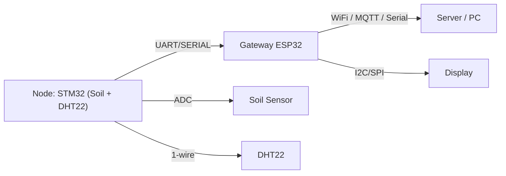

Source code overview

Thư mục `source_code/` chứa firmware nhúng cho cả hai board chính của dự án.

Structure:

- `gateway_esp32/` — firmware ESP32 (PlatformIO) chịu trách nhiệm làm gateway, inference MLP, MQTT.
- `gateway_esp32_ver2/` — biến thể/phiên bản nâng cấp nếu có.
- `soil_dht22_stm32/` — firmware STM32 đọc ADC và DHT22, xuất JSON qua UART.

Hướng dẫn nhanh:

- Xem các README cụ thể trong từng subfolder để biết cách build và cấu hình.
**Sensor Networks — Source Code**

Phiên bản: chuyên nghiệp, đầy đủ tài liệu (Tiếng Việt)

**Tóm tắt dự án**
- **Mục tiêu**: Đây là bộ mã nguồn cho hệ đo đạc cảm biến đất và môi trường (soil moisture, DHT22, hiển thị, gateway ESP32 và MCU STM32). Dự án tích hợp thu thập dữ liệu, xử lý tại biên với mô hình MLP nhúng, truyền tin qua cổng nối tiếp/khung mạng, và các ví dụ về firmware cho ESP32 và STM32.

**Đặc tả tổng quan**
- **Phần mềm**: Các firmware cho hai nền tảng chính:
  - [gateway_esp32](gateway_esp32): dự án PlatformIO cho ESP32 (có `platformio.ini`, mã nguồn trong `src/`).
  - [gateway_esp32_ver2](gateway_esp32_ver2): bản cải tiến, có `comm.h`, `display.h`, `mlp_model.h`.
  - [soil_dht22_stm32](soil_dht22_stm32): mã nguồn dành cho MCU STM32 (Keil/UVision project files, thư viện cho ADC, DHT22, UART).

- **Mô hình ML**: Thư mục `mlp_model.c/h` xuất hiện trong nhiều nơi — là implement inference của một mạng nơ-ron đa tầng (MLP) được chuyển mã C để chạy trên MCU.

**Cấu trúc repository**
- **Tệp gốc**: `not_tft_monitor.cpp` — tập tin thử nghiệm/ví dụ.
- **[gateway_esp32](gateway_esp32)**: firmware ESP32 với PlatformIO.
- **[gateway_esp32_ver2](gateway_esp32_ver2)**: firmware ESP32 - version 2.
- **[soil_dht22_stm32](soil_dht22_stm32)**: STM32 project, thư viện `lib/inc` và `lib/src`.

**Kiến thức nền tảng (Theory → Practice)**

**1) Cảm biến môi trường**
- **DHT22 (AM2302)**: cảm biến đo nhiệt độ và độ ẩm kỹ thuật số. Giao tiếp 1-wire-like (một dây dữ liệu, cần pull-up). Độ chính xác điển hình ±0.5°C cho nhiệt độ và ±2–5% cho độ ẩm. Thời gian đọc ~250ms.
- **Cảm biến độ ẩm đất (Analog)**: thường là một điện trở/điện dung thay đổi theo độ ẩm; đọc qua ADC của MCU. Cần hiệu chuẩn theo đất cụ thể (đất khô, ẩm tối đa) để chuyển giá trị ADC sang phần trăm độ ẩm.

**2) Xử lý tín hiệu & tiền xử lý**
- **Lọc nhiễu**: trung bình trượt (moving average) hoặc lọc Kalman nhẹ để ổn định tín hiệu ADC.
- **Bù nhiệt độ & hiệu chuẩn**: áp dụng các hệ số hiệu chuẩn nếu cảm biến có nonlinearity.

**3) MLP nhúng (Inference trên MCU)**
- **Cấu trúc chung**: MLP thường gồm một số lớp fully-connected, hàm kích hoạt ReLU/tanh và lớp đầu ra sigmoid/linear tùy tác vụ (phân loại/rời rạc hoặc hồi quy). `mlp_model.c` chứa trọng số đã huấn luyện (hardened) và hàm inference.
- **Triển khai trên MCU**: thực hiện bằng toán học kiểu floating-point hoặc fixed-point (nếu MCU không có FPU). Trước khi triển khai, cần tối ưu: pruning, quantization (int8/uint8) và tối ưu thứ tự tính toán để giảm bộ nhớ tạm.

**4) Giao thức truyền tin & Kiến trúc hệ thống**
- **Cấp thiết bị**: Các node (STM32 hoặc ESP32) đọc sensor → xử lý → gửi dữ liệu qua UART/Serial hoặc Wi‑Fi (ESP32) đến gateway/điểm tập trung.
- **Phần mềm truyền tin**: file `comm.h` / `comm.cpp` (trong [gateway_esp32_ver2](gateway_esp32_ver2)) quản lý khung dữ liệu, checksum/CRC, định dạng payload (timestamp, sensor_id, giá trị ADC, trạng thái pin).

**Sơ đồ tổng thể**


**Hướng dẫn build & nạp firmware**

- **Yêu cầu môi trường**: cài `PlatformIO` (IDE: VSCode + PlatformIO extension) cho các project ESP32; để build STM32 dùng Keil uVision hoặc ARM GCC + Make (tùy vào file `uvprojx`/`uvoptx`).

- **Build & upload ESP32 (PlatformIO)**:
```bash
# Vào thư mục project
cd gateway_esp32
# build
pio run
# upload (kết nối board qua USB)
pio run -t upload
```

- **Build ESP32 version 2**:
```bash
cd gateway_esp32_ver2
pio run
pio run -t upload
```

- **STM32 (Keil uVision)**: mở `soil_dht22_stm32/main_code.uvprojx` bằng Keil và build/upload qua ST-Link.

**Liên kết tệp chính**
- **ESP32 main**: [gateway_esp32/src/main.cpp](gateway_esp32/src/main.cpp)
- **ESP32 ver2**: [gateway_esp32_ver2/src/main.cpp](gateway_esp32_ver2/src/main.cpp)
- **MLP model (C)**: [gateway_esp32/prj_lib/mlp_model.c](gateway_esp32/prj_lib/mlp_model.c) và [gateway_esp32/prj_lib/mlp_model.h](gateway_esp32/prj_lib/mlp_model.h)
- **STM32 giao tiếp & cảm biến**: [soil_dht22_stm32/lib/inc/dht22.h](soil_dht22_stm32/lib/inc/dht22.h), [soil_dht22_stm32/lib/src/dht22.c](soil_dht22_stm32/lib/src/dht22.c)

**Chi tiết về `mlp_model.c`**
- **Mục đích**: thực hiện inference — nhận vectơ đặc trưng (ví dụ: ADC_normalized, temperature, humidity, time_window_stats) và trả về dự đoán (ví dụ: phân loại trạng thái đất: `dry`, `optimal`, `wet` hoặc giá trị độ ẩm ước lượng).
- **Kiến trúc phổ biến**: input → Dense(64, ReLU) → Dense(32, ReLU) → Dense(1, Linear) cho hồi quy.
- **Tối ưu trên MCU**:
  - Dùng `float` nếu MCU có FPU (ESP32 có FPU, STM32F103 không có FPU đầy đủ → cân nhắc fixed-point).
  - Giảm kích thước bảng trọng số qua quantization (int8) nếu cần.

**Lời khuyên huấn luyện mô hình**
- **Thu thập dữ liệu**: ghi nhãn dữ liệu thực tế (độ ẩm tuyệt đối bằng cân hoặc cảm biến tham chiếu) trong nhiều điều kiện đất/độ ẩm.
- **Tiền xử lý**: chuẩn hóa từng chiều theo mean/std hoặc min-max; lưu thông số chuẩn hóa cùng mô hình để áp dụng trên firmware.
- **Kiểm thử**: tách dữ liệu train/val/test; kiểm tra độ trễ inference và bộ nhớ khi triển khai lên MCU.

**Kiểm thử & xác thực (Testing)**
- **Unit test**: viết test cho hàm đọc DHT22, đọc ADC, và hàm inference MLP (so sánh output với giá trị từ Python reference).
- **Integration**: kết nối node với gateway, mô phỏng nhiều mức độ ẩm, kiểm tra payload và CRC.

**Mẹo thực hành (Best Practices)**
- **Power**: cung cấp nguồn sạch (3.3V) cho ESP32 và sensor; tránh nhiễu ADC từ các đường USB/nguồn.
- **Bảo vệ cảm biến đất**: dùng điện trở giới hạn dòng hoặc mạch cầu đo điện dung thay vì cắm trực tiếp điện cực dẫn điện để giảm ăn mòn.
- **Cập nhật mô hình**: tách phần inference và trọng số; giữ file trọng số có thể cập nhật qua OTA nếu dùng ESP32 với WiFi.

**Mở rộng**
- Thêm hỗ trợ MQTT/HTTP trên `gateway_esp32` để đẩy dữ liệu lên cloud.
- Thu thập dữ liệu thô và huấn luyện lại mô hình trên server với framework như TensorFlow/PyTorch, sau đó xuất ra trọng số cho firmware.

**Tài liệu tham khảo & học thêm**
- DHT22 datasheet (AM2302) — đọc kỹ đặc tính giao tiếp và thời gian phản hồi.
- Các tài nguyên về MLP nhúng: TensorFlow Lite for Microcontrollers, CMSIS-NN (ARM).

**File liên quan & tham chiếu nhanh**
- [gateway_esp32](gateway_esp32)
- [gateway_esp32_ver2](gateway_esp32_ver2)
- [soil_dht22_stm32](soil_dht22_stm32)

**Giấy phép**
- Mặc định không có tệp license trong repo; nếu bạn muốn, tôi có thể thêm một `LICENSE` (ví dụ MIT/Apache-2.0). Hãy cho biết loại giấy phép mong muốn.

---
Nếu bạn muốn, tôi có thể:
- Cập nhật README với sơ đồ phần cứng cụ thể (sơ đồ chân, điện áp),
- Thêm ví dụ dataset và script Python để huấn luyện lại MLP,
- Hoặc tạo file `CONTRIBUTING.md` và `LICENSE`.

**Phân tích mã nguồn chi tiết (Deep Dive)**

Đoạn này giải thích chi tiết các thành phần chính trong mã, tham chiếu trực tiếp tới các file trong repository để bạn dễ kiểm tra.

**1) MLP — chi tiết triển khai**
- File tham chiếu: [gateway_esp32_ver2/src/mlp_model.c](gateway_esp32_ver2/src/mlp_model.c)
- Tiền xử lý (normalization):
  - Công thức sử dụng trong `mlp_predict`:
    - $x_{norm} = (x - \mu)/\sigma$ với `scaler_mean` và `scaler_std` (mảng 3 phần tử lưu trong file). Các giá trị mean/std được gắn cứng trong mã.
  - Ý nghĩa: đảm bảo đầu vào có phân phối tương tự dữ liệu huấn luyện — bắt buộc để inference ổn định.

- Kiến trúc mạng (nhìn trực tiếp từ file):
  - Lớp 1: W1 shape (3 x 16), B1 length 16
  - Lớp 2: W2 shape (16 x 8),  B2 length 8
  - Lớp 3: W3 shape (8),       B3 scalar
  - Tổng hệ số (weights + biases): 3*16 + 16 + 16*8 + 8 + 8 + 1 = 209 tham số (float).

- Hàm kích hoạt: `tanhf` cho tất cả các lớp (hidden + output). Phân loại nhị phân được thực hiện bằng `mlp_classify`: nếu output > 0 → class 1 (WARNING), ngược lại class 0 (NORMAL).

- Chi phí tính toán (ước lượng):
  - Phép nhân theo lớp: 48 + 128 + 8 = 184 multiplications
  - Cộng các phép cộng tương ứng và 3 lần gọi hàm tanh.
  - Nếu tính MACs (mult+add) ≈ 2 * 184 = 368 MACs per inference (xấp xỉ).

- Bộ nhớ (ước tính):
  - Trọng số float (4 bytes each): 209 * 4 = 836 bytes trong vùng flash/RO.
  - Bộ nhớ tạm cho activations: `hidden1` 16*4 = 64 bytes, `hidden2` 8*4 = 32 bytes, cộng input và overhead → < 200 bytes RAM.

- Ghi chú triển khai:
  - Mã dùng `float` — phù hợp cho ESP32 (FPU), nhưng nếu muốn chạy trên STM32F1 (không có FPU đầy đủ), cần chuyển sang fixed-point hoặc dùng CMSIS-DSP/TensorFlow Lite Micro.
  - Activation `tanh` giữ output trong [-1,1], phù hợp khi model huấn luyện dùng chuẩn hóa mean/std; so sánh: ReLU tiết kiệm tính toán nhưng có phân phối khác.

**2) Gateway / Comm (ESP32)**
- Files tham chiếu: [gateway_esp32_ver2/src/comm.cpp](gateway_esp32_ver2/src/comm.cpp) và [gateway_esp32_ver2/include/comm.h](gateway_esp32_ver2/include/comm.h)
- MQTT / ThingsBoard:
  - Kết nối tới `thingsboard.cloud` mặc định, topic telemetry: `v1/devices/me/telemetry`.
  - Gửi payload JSON dạng:
    - `{"temperature":<temp>,"humidity":<hum>,"soil":<soil>,"prediction":<pred>,"ai_state":<str>,"led_state":<0|1>}`

- RPC (device RPC từ ThingsBoard):
  - Hỗ trợ các method JSON `setControlMode`, `setManualState`, `getControlMode`, `getManualState`.
  - `setControlMode` chấp nhận `{"mode":"MANUAL"}` hoặc `{"mode":"AI"}` và trả response JSON trạng thái.

- JSON từ STM32:
  - ESP32 đọc chuỗi UART (Serial2) tới `parseJSON` và mong đợi định dạng: `{"temp":%.1f,"hum":%.1f,"soil":%d}` (được STM32 tạo bởi `UART2_SendJSON`).
  - Nếu parse thành công, gateway gọi `mlp_predict` (nếu ở chế độ AI) rồi cập nhật hiển thị và gửi telemetry.

**3) STM32 drivers & sensor code**
- Files tham chiếu:
  - `soil_dht22_stm32/lib/src/dht22.c` — driver DHT22
  - `soil_dht22_stm32/lib/src/adc_soil.c` — ADC, đọc soil và chuyển về phần trăm
  - `soil_dht22_stm32/lib/src/uart.c` — nạp JSON và gửi qua UART
  - `soil_dht22_stm32/lib/src/timer_delay.c` — TIM2 config (đơn vị us)

- DHT22 timing & đọc bit (tóm tắt từ `dht22.c`):
  - `TIM2` cấu hình với prescaler = 72-1 → đếm ở 1 MHz (1 count = 1 µs) (xem `TIM2_Config` trong `timer_delay.c`).
  - Khi đọc từng bit, driver đặt counter = 0 sau cạnh rồi đo thời gian giữ mức cao; ngưỡng `> 40` (µs) được dùng để phân biệt `0` và `1` (theo đặc tính DHT22, bit 0 ≈ 26–28 µs, bit 1 ≈ 70 µs).
  - Start signal: MCU kéo dữ liệu xuống 20 ms, sau đó nhả và chờ phản hồi từ DHT22 (chuỗi handshake theo datasheet).

- ADC & soil percent (`adc_soil.c`):
  - ADC1 channel 0 (PA0), cấu hình sample time 55.5 cycles, continuous mode.
  - `Read_ADC_Average()` trung bình 10 mẫu, mỗi mẫu cách nhau 5 ms (tổng ~50 ms để lấy trung bình).
  - Quy đổi: `Soil_Moisture_Percent()` trả `(4095 - adc_value) * 100 / 4095` — giả sử điện áp tăng khi đất khô (tùy mạch cảm biến), nên công thức đảo 4095 - adc.
  - Ghi chú: cần hiệu chuẩn (ADC dry/wet) cho từng probe & đất để lấy % thực.

- UART JSON (STM32):
  - `UART2_SendJSON(float temp, float hum, int soil)` dùng `sprintf` để format:
    - `{"temp":%.1f,"hum":%.1f,"soil":%d}\r\n`
  - ESP32 đọc theo dòng (`\n`) và parse bằng ArduinoJson trên phía ESP.

**4) Bảo toàn tính chính xác & tối ưu hoá**
- Nếu muốn giảm bộ nhớ và thời gian inference trên MCU:
  - Quantization int8 (ưu tiên khi không có FPU), hoặc 16-bit fixed-point.
  - Dùng TFLite Micro hoặc CMSIS-NN để tận dụng hạ tầng tối ưu.
  - Nếu giữ float, giảm kích thước model (pruning/layer nhỏ hơn) và tránh lưu nhiều biến tạm.

- Về giao tiếp:
  - JSON gọn nhưng có overhead; trên kênh UART chậm, cân nhắc sử dụng binary frame (ví dụ: header, payload struct, CRC16) để tiết kiệm băng thông và tăng độ tin cậy.
  - Thêm CRC/checksum nếu môi trường nhiễu cao.

**5) Kiểm thử & đo đạc hiệu năng (gợi ý nghiệm thu)**
- Đo thời gian inference trên ESP32 (millis()/micros()) cho 1000 lần lặp để lấy trung bình.
- Đo RAM/Flash sử dụng `pio run --target size` hoặc Keil map file để xác định footprint của hàm `mlp_predict` và dữ liệu.

**6) Nâng cao (tùy chọn)**
- Hỗ trợ OTA để cập nhật trọng số model trên ESP32 (tránh phải nạp lại qua USB).
- Thay JSON qua UART bằng format binary + CRC, giữ JSON cho MQTT/Cloud.
- Viết script chuyển model từ Python (TensorFlow/PyTorch) sang C (numpy -> C arrays) tự động, kèm file chuẩn hóa (mean/std) để tránh sai số.

---
Tôi đã phân tích các file chính và chuẩn bị nội dung để chèn trực tiếp vào `README.md`. Muốn tôi:
- (A) bổ sung các đoạn mã trích dẫn (code snippets) cụ thể với đường dẫn line số, hoặc
- (B) tự động chèn bản kiểm tra hiệu năng (benchmark) và script Python mẫu để tái tạo mô hình?
