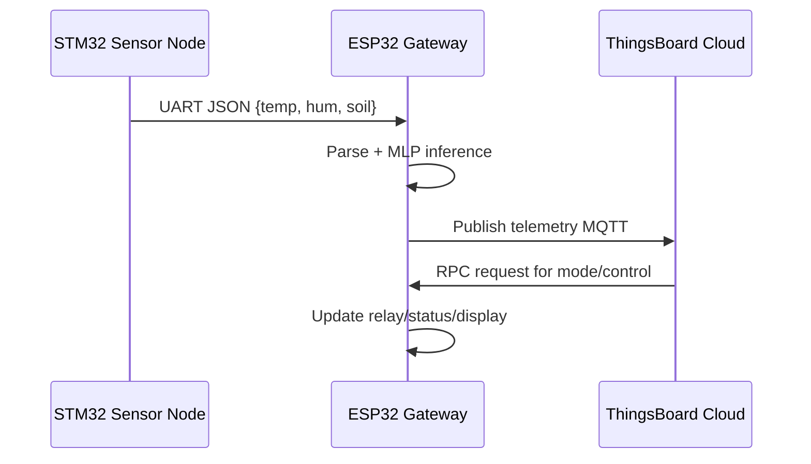
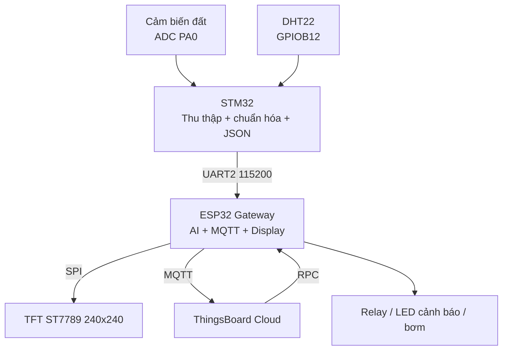
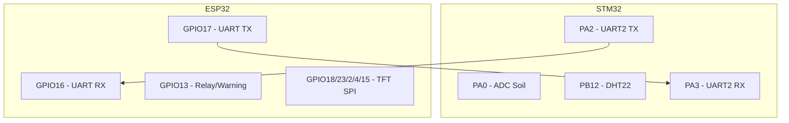
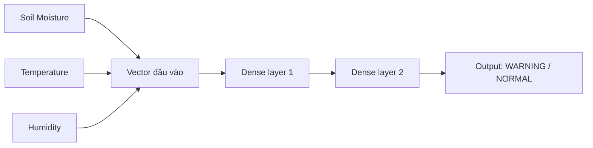
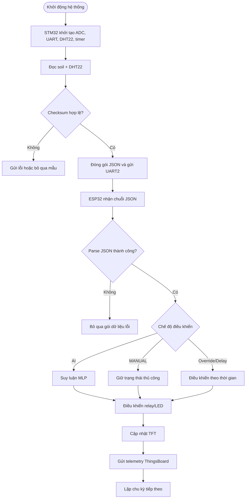
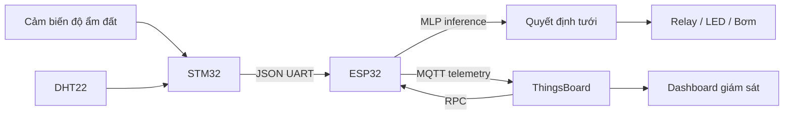

## Source Code

Tài liệu báo cáo cho toàn bộ mã nguồn của hệ thống giám sát và tưới cây thông minh.

### Mục tiêu tài liệu

Tệp này được viết theo phong cách báo cáo học thuật, dùng để mô tả đầy đủ cơ sở lý thuyết, thiết kế hệ thống, luồng dữ liệu, và cách phần mềm trong thư mục này thực thi trong thực tế. Nội dung ưu tiên khớp với code hiện có trong repo; những chỗ chưa đủ dữ kiện chắc chắn sẽ được mô tả ở mức khái quát để tránh ghi sai.

### Phạm vi dự án

Thư mục `source_code/` chứa toàn bộ firmware và thành phần điều khiển cho một hệ thống IoT - AI giám sát độ ẩm đất, nhiệt độ, độ ẩm không khí và điều khiển tưới/cảnh báo tự động. Hệ thống được chia thành hai lớp thiết bị chính:

1. Node cảm biến sử dụng STM32 để đọc dữ liệu môi trường và đất.
2. Gateway ESP32 để nhận dữ liệu, suy luận bằng mô hình MLP, hiển thị lên màn hình TFT, và đồng bộ lên ThingsBoard qua MQTT.

## Cấu trúc thư mục

```text
source_code/
├── not_tft_monitor.cpp
├── gateway_esp32/
│   ├── platformio.ini
│   ├── src/
│   ├── include/
│   └── prj_lib/
├── gateway_esp32_ver2/
│   ├── platformio.ini
│   ├── src/
│   └── include/
└── soil_dht22_stm32/
    ├── main_code.c
    ├── lib/
    ├── RTE/
    └── project files for Keil/UVision
```

### Vai trò từng phần

- `gateway_esp32/`: firmware ESP32 phiên bản nền tảng, làm gateway, nhận dữ liệu UART, suy luận MLP, gửi MQTT.
- `gateway_esp32_ver2/`: phiên bản ESP32 nâng cấp, có bổ sung phần hiển thị TFT, giao tiếp ThingsBoard, RPC, trạng thái điều khiển AI/MANUAL và các trạng thái pump theo thời gian.
- `soil_dht22_stm32/`: firmware STM32 đọc DHT22 và cảm biến độ ẩm đất, xuất dữ liệu dạng JSON qua UART2.
- `not_tft_monitor.cpp`: tệp thử nghiệm hoặc ví dụ riêng lẻ, không phải luồng chính của hệ thống.

## Chương 1. Cơ sở lý thuyết và tổng quan về hệ thống giám sát, tưới cây thông minh

### 1.1. Tổng quan về IoT và mạng cảm biến trong nông nghiệp

IoT trong nông nghiệp là mô hình kết nối các thiết bị cảm biến, bộ chấp hành, bộ xử lý biên, và nền tảng cloud để tạo thành một chuỗi giám sát - phản hồi tự động. Thay vì phụ thuộc hoàn toàn vào kinh nghiệm thủ công, hệ thống IoT cho phép thu thập dữ liệu theo thời gian thực, lưu trữ lịch sử, trực quan hóa và ra quyết định dựa trên dữ liệu.

Trong bài toán tưới cây thông minh, các đại lượng quan trọng thường gồm:

- Độ ẩm đất.
- Nhiệt độ môi trường.
- Độ ẩm không khí.
- Trạng thái tưới, cảnh báo hoặc điều khiển tay.

Mạng cảm biến trong nông nghiệp có những đặc trưng sau:

- Nút cảm biến thường phân tán ở nhiều vị trí khác nhau.
- Tài nguyên phần cứng hạn chế, đặc biệt về RAM, flash và năng lượng.
- Môi trường làm việc có nhiễu, ẩm, bụi và biến thiên lớn.
- Dữ liệu thu thập thường cần được chuẩn hóa, lọc và đồng bộ theo chu kỳ.

Trong hệ thống này, STM32 đóng vai trò nút cảm biến, còn ESP32 đóng vai trò gateway biên. Cách phân lớp này hợp lý vì STM32 đảm nhiệm phần đọc cảm biến thời gian thực ổn định, trong khi ESP32 đủ mạnh để thực hiện kết nối Wi-Fi, MQTT, giao diện hiển thị và suy luận AI.

### 1.2. Mạng nơ-ron nhân tạo và mô hình MLP trong bài toán phân loại tưới

Mạng nơ-ron nhân tạo là một mô hình tính toán mô phỏng phần nào cơ chế học từ dữ liệu. Trong các bài toán điều khiển tưới, đầu vào của mô hình thường là các đặc trưng như độ ẩm đất, nhiệt độ và độ ẩm không khí; đầu ra là một quyết định hoặc điểm số phản ánh trạng thái cần tưới hay không.

MLP, hay Multi-Layer Perceptron, là một cấu trúc mạng nơ-ron truyền thẳng nhiều lớp. Đặc trưng của MLP là:

- Lớp đầu vào nhận vector đặc trưng.
- Một hoặc nhiều lớp ẩn học các quan hệ phi tuyến giữa đầu vào và đầu ra.
- Lớp đầu ra sinh ra dự đoán cuối cùng.

Trong bối cảnh hệ thống này, MLP được đưa xuống chạy trực tiếp trên ESP32 thông qua file mô hình C nhúng. Đây là hướng tiếp cận phù hợp cho các hệ thống edge AI vì:

- Giảm phụ thuộc vào cloud trong bước ra quyết định.
- Tăng tốc độ phản hồi.
- Giảm băng thông truyền dữ liệu.
- Cho phép hệ thống tiếp tục hoạt động ngay cả khi mất kết nối Internet.

### Nguyên lý xử lý của MLP

Với một vector đầu vào $x$, tầng ẩn của MLP thực hiện phép biến đổi tuyến tính và phi tuyến:

$$
z = W x + b
$$

$$
a = f(z)
$$

Trong đó:

- $W$ là ma trận trọng số.
- $b$ là vector bias.
- $f$ là hàm kích hoạt như ReLU, tanh hoặc sigmoid.

Ở mức triển khai nhúng, mô hình thường được huấn luyện trên máy tính rồi xuất trọng số sang file C để thực hiện inference trên vi điều khiển.

### Ý nghĩa trong bài toán tưới cây

MLP không chỉ xét ngưỡng đơn giản của một cảm biến, mà kết hợp nhiều biến đầu vào để suy luận trạng thái cây trồng tốt hơn. Điều này đặc biệt hữu ích khi:

- Độ ẩm đất chưa thấp đến mức cực hạn nhưng nhiệt độ cao khiến tốc độ bay hơi tăng.
- Độ ẩm không khí thấp làm đất khô nhanh hơn bình thường.
- Cảm biến đất có nhiễu hoặc cần hiệu chuẩn theo từng loại đất.

### 1.3. Tổng quan về vi điều khiển ESP32 và STM32 trong hệ thống IoT

#### ESP32

ESP32 là dòng vi điều khiển tích hợp Wi-Fi/Bluetooth, thường dùng trong các hệ thống IoT cần kết nối mạng, giao diện web hoặc cloud. Trong dự án này, ESP32 đảm nhận các nhiệm vụ:

- Nhận dữ liệu cảm biến từ STM32 qua UART2.
- Phân tích chuỗi JSON đầu vào.
- Gọi hàm `mlp_predict()` để suy luận AI.
- Điều khiển ngõ ra cảnh báo/tưới.
- Hiển thị dữ liệu lên màn hình TFT ST7789.
- Gửi telemetry lên ThingsBoard qua MQTT.
- Nhận RPC từ ThingsBoard để chuyển chế độ điều khiển.

#### STM32

STM32 trong hệ thống này là bộ xử lý thu thập dữ liệu cảm biến. Vai trò của nó là:

- Đọc giá trị analog từ cảm biến độ ẩm đất qua ADC.
- Giao tiếp với DHT22 để đọc nhiệt độ và độ ẩm.
- Chuẩn hóa dữ liệu và đóng gói thành chuỗi JSON.
- Gửi dữ liệu sang ESP32 qua UART2 ở tốc độ 115200 bps.

STM32 phù hợp cho nhiệm vụ này vì:

- Điều khiển thời gian chính xác.
- Các ngoại vi ADC, GPIO, USART hoạt động ổn định.
- Code driver mức thấp có thể tối ưu cho timing của DHT22.

#### Lý do phối hợp hai vi điều khiển

Việc tách nhiệm vụ giữa STM32 và ESP32 mang lại một kiến trúc rõ ràng:

- STM32 xử lý tín hiệu và đọc cảm biến thời gian thực.
- ESP32 xử lý mạng, AI và giao diện.

Cách làm này giảm tải từng chip và giúp hệ thống dễ bảo trì hơn so với việc ép toàn bộ nhiệm vụ lên một vi điều khiển duy nhất.

### 1.4. Giới thiệu các cảm biến, thiết bị sử dụng trong hệ thống

#### Cảm biến độ ẩm đất

Trong mã nguồn STM32, cảm biến độ ẩm đất được đưa vào ADC1 channel 0 trên PA0. Dữ liệu ADC được đọc nhiều lần rồi lấy trung bình để giảm nhiễu. Sau đó, giá trị được quy đổi sang phần trăm theo phép xấp xỉ đảo thang đo ADC.

Đặc điểm cần lưu ý:

- Mỗi loại probe có đặc tính khác nhau.
- Giá trị phần trăm trong code là mức quy đổi tương đối nếu chưa hiệu chuẩn riêng.
- Hiệu chuẩn đất khô và đất ướt là bước quan trọng nếu dùng trong thực tế.

#### DHT22

DHT22 là cảm biến nhiệt độ và độ ẩm số. Trong dự án, cảm biến này được đọc bằng bit-banging trên GPIOB12 của STM32. Tín hiệu dữ liệu của DHT22 có đặc thù timing chặt chẽ, nên phần driver phải dùng timer vi giây để phân biệt bit 0 và bit 1.

Đầu ra từ DHT22 gồm:

- Nhiệt độ.
- Độ ẩm không khí.
- Byte checksum để kiểm tra lỗi truyền.

#### Màn hình TFT ST7789

Ở phiên bản ESP32 ver2, hệ thống có màn hình TFT 240x240 dùng giao tiếp SPI. Màn hình được dùng để hiển thị:

- Trạng thái khởi động.
- Độ ẩm không khí.
- Nhiệt độ.
- Độ ẩm đất.
- Trạng thái hệ thống như WARNING, NORMAL, MANUAL.

Việc hiển thị cục bộ giúp hệ thống hữu ích ngay cả khi chưa đồng bộ lên cloud.

#### Relay hoặc ngõ ra điều khiển bơm

Trong code ESP32, LED hoặc ngõ ra điều khiển được đặt ở GPIO13 và dùng mức logic đảo:

- `LOW` tương ứng bật.
- `HIGH` tương ứng tắt.

Điều này thường thấy ở module relay kích mức thấp.

### 1.5. Giao thức truyền thông MQTT và nền tảng ThingsBoard

MQTT là giao thức truyền thông publish/subscribe nhẹ, đặc biệt phù hợp với thiết bị IoT vì:

- Header nhỏ, tiết kiệm băng thông.
- Hỗ trợ mô hình topic linh hoạt.
- Phù hợp cho kết nối mạng không ổn định.

Trong hệ thống này, ESP32 kết nối tới ThingsBoard và gửi telemetry theo topic:

- `v1/devices/me/telemetry`

ESP32 cũng lắng nghe RPC request từ topic:

- `v1/devices/me/rpc/request/+`

ThingsBoard được dùng làm nền tảng quản lý dữ liệu và điều khiển thiết bị. Từ đây, người vận hành có thể:

- Xem dữ liệu đo theo thời gian thực.
- Xem lịch sử telemetry.
- Gửi lệnh RPC để đổi chế độ AI/MANUAL.
- Điều khiển bơm hoặc kích hoạt override theo thời lượng.

### Luồng MQTT tổng quát



## Chương 2. Thiết kế và xây dựng hệ thống giám sát và tưới cây thông minh

### 2.1. Kiến trúc tổng thể hệ thống IoT và AI

Hệ thống được thiết kế theo mô hình phân tầng ba lớp:

#### Lớp thu thập dữ liệu

STM32 đọc:

- Độ ẩm đất bằng ADC.
- Nhiệt độ và độ ẩm không khí từ DHT22.

#### Lớp xử lý biên và điều khiển

ESP32 nhận dữ liệu, xử lý, suy luận mô hình MLP và quyết định trạng thái điều khiển. Ngoài AI mode, hệ thống còn hỗ trợ manual mode và các trạng thái override theo thời gian.

#### Lớp nền tảng giám sát

ThingsBoard nhận telemetry, cho phép hiển thị và giám sát từ xa.

### Sơ đồ kiến trúc tổng thể



### 2.2. Thiết kế phần cứng hệ thống

Phần cứng trong code hiện tại có thể mô tả theo cấu trúc sau.

#### Khối STM32

Các chân và ngoại vi đáng chú ý:

- PA0: ADC đọc cảm biến độ ẩm đất.
- PB12: DHT22 data pin.
- PA2: UART2 TX.
- PA3: UART2 RX.
- PA9: UART1 TX cho `printf` debug.
- PA10: UART1 RX.

#### Khối ESP32

Các chân được dùng trong code ver2:

- GPIO16: UART RX từ STM32.
- GPIO17: UART TX về STM32 nếu cần.
- GPIO13: ngõ ra cảnh báo hoặc relay.
- GPIO18: SCK cho TFT SPI.
- GPIO23: MOSI cho TFT SPI.
- GPIO2: DC.
- GPIO4: RESET.
- GPIO15: backlight.

#### Phần hiển thị

Màn hình TFT được sử dụng như một dashboard cục bộ. Code hiển thị tối giản nhưng đầy đủ các vùng dữ liệu:

- Vùng tiêu đề.
- Vùng độ ẩm.
- Vùng nhiệt độ.
- Vùng độ ẩm đất.
- Vùng trạng thái AI.

#### Gợi ý sơ đồ chân



### 2.3. Thu thập, tiền xử lý và chuẩn hóa dữ liệu cảm biến

#### Thu thập dữ liệu từ STM32

Trong `main_code.c`, vòng lặp chính thực hiện các bước:

1. Đọc độ ẩm đất.
2. Gửi lệnh khởi tạo đọc DHT22.
3. Nhận dữ liệu nhiệt độ và độ ẩm.
4. Kiểm tra checksum của DHT22.
5. Nếu dữ liệu hợp lệ, xuất JSON qua UART2.
6. Lặp lại sau mỗi 2 giây.

#### Lọc và ổn định dữ liệu ADC

Độ ẩm đất là một tín hiệu rất dễ nhiễu. Code STM32 dùng trung bình 10 mẫu liên tiếp, mỗi mẫu cách nhau 5 ms. Đây là một dạng lọc trung bình trượt đơn giản nhưng hiệu quả trong thực tế.

Lợi ích:

- Giảm dao động tức thời.
- Làm dữ liệu đưa vào MLP ổn định hơn.
- Hạn chế kích hoạt bơm sai do nhiễu.

#### Chuẩn hóa dữ liệu

Ở tầng AI, dữ liệu đầu vào có thể cần chuẩn hóa trước khi đưa vào mạng nơ-ron. Trong kiến trúc này, code ESP32 gọi `mlp_predict((float)soil, temp, hum)`. Điều đó cho thấy mô hình được xây dựng sao cho ba đặc trưng đầu vào là:

- Độ ẩm đất.
- Nhiệt độ.
- Độ ẩm không khí.

Nếu bộ trọng số MLP đã được huấn luyện với dữ liệu chuẩn hóa, việc này phải được nhất quán với quá trình training. Do không thấy đầy đủ file huấn luyện Python trong repo hiện tại, phần mô tả chi tiết về chuẩn hóa nên hiểu theo nguyên tắc tổng quát sau:

$$
x' = \frac{x - \mu}{\sigma}
$$

hoặc theo min-max:

$$
x' = \frac{x - x_{min}}{x_{max} - x_{min}}
$$

### 2.4. Xây dựng mô hình MLP cho bài toán phân loại quyết định tưới

Mô hình MLP trong dự án được nhúng vào code C/C++ và được gọi từ ESP32. Theo luồng xử lý hiện có, MLP làm nhiệm vụ phân loại trạng thái tưới theo đầu vào cảm biến.

#### Vai trò của mô hình

MLP nhận dữ liệu đã đo và trả về một giá trị suy luận. Dựa trên code ESP32, quy ước hiện tại là:

- Nếu đầu ra lớn hơn 0: trạng thái cảnh báo hoặc cần tưới.
- Nếu đầu ra nhỏ hơn hoặc bằng 0: trạng thái bình thường.

#### Lý do dùng MLP thay vì ngưỡng cứng

Một hệ thống tưới chỉ dựa vào ngưỡng độ ẩm đất thường gặp các hạn chế:

- Không xét nhiệt độ môi trường.
- Không xét độ ẩm không khí.
- Không phản ánh tính phi tuyến giữa các yếu tố.

MLP giúp kết hợp nhiều yếu tố để đưa ra quyết định mềm dẻo hơn. Đây là hướng tiếp cận thực tiễn khi điều kiện môi trường biến thiên liên tục.

#### Quy trình tổng quát xây dựng mô hình

1. Thu thập dữ liệu cảm biến thực tế.
2. Gán nhãn tưới hoặc không tưới theo hiện tượng thực tế hoặc chuyên gia.
3. Làm sạch dữ liệu, loại bỏ mẫu lỗi.
4. Chuẩn hóa dữ liệu đầu vào.
5. Huấn luyện MLP trên máy tính.
6. Xuất trọng số thành file C.
7. Nhúng vào firmware ESP32.
8. Kiểm tra inference và độ ổn định.

#### Sơ đồ luồng MLP



### 2.5. Tích hợp mô hình MLP và kết nối hệ thống với nền tảng ThingsBoard

#### Tích hợp MLP trong ESP32

Trong `gateway_esp32_ver2/src/main.cpp`, sau khi nhận chuỗi JSON từ STM32 và parse thành công, ESP32 sẽ:

1. Tách `temp`, `hum`, `soil`.
2. Xác định chế độ hiện tại.
3. Nếu ở AI mode, gọi `mlp_predict((float)soil, temp, hum)`.
4. Dựa trên kết quả, điều khiển ngõ ra cảnh báo hoặc relay.
5. Cập nhật TFT.
6. Gửi dữ liệu lên ThingsBoard.

#### Các trạng thái điều khiển trong code

Code hiện tại không chỉ có AI và MANUAL, mà còn có các trạng thái thời gian đặc biệt:

- `MODE_AI`: điều khiển bằng mô hình.
- `MODE_MANUAL`: điều khiển thủ công từ RPC.
- `pumpOverrideActive`: bật bơm theo thời lượng cố định rồi trả về trạng thái cũ.
- `pumpDelayActive`: chờ một khoảng thời gian, sau đó bơm trong thời lượng nhất định, rồi trả về trạng thái cũ.

Đây là một điểm mạnh của kiến trúc vì hệ thống không chỉ dừng ở phân loại nhị phân, mà còn hỗ trợ kịch bản vận hành thực tế.

#### RPC từ ThingsBoard

Trong `comm.cpp`, các lệnh RPC hỗ trợ gồm:

- `setControlMode` để chuyển giữa `AI` và `MANUAL`.
- `setManualState` để bật hoặc tắt relay khi đang ở manual.
- `pumpOverride` để kích hoạt bơm theo thời lượng.
- `getControlMode` để truy vấn chế độ.
- `getManualState` để truy vấn trạng thái thủ công.

Nhờ RPC, người quản trị có thể điều khiển thiết bị từ xa mà không phải chỉnh firmware lại.

#### Telemetry lên ThingsBoard

Payload telemetry do ESP32 gửi đi chứa các trường chính sau:

- `temperature`
- `humidity`
- `soil`
- `prediction`
- `ai_state`
- `led_state`
- `control_mode`
- `manual_state`

Nhóm dữ liệu này đủ để xây dựng dashboard theo dõi toàn diện. Nếu cần, ThingsBoard có thể hiển thị biểu đồ, trạng thái hiện tại, nút điều khiển, và lịch sử hoạt động.

### Sơ đồ luồng xử lý chi tiết



## Phân tích thực thi phần mềm theo từng khối mã

### STM32: vòng lặp đo đạc

File [soil_dht22_stm32/main_code.c](soil_dht22_stm32/main_code.c) thể hiện rõ pipeline cảm biến:

- Khởi tạo UART1, UART2, timer, DHT22 và ADC.
- Đọc độ ẩm đất.
- Khởi động DHT22 và đọc dữ liệu.
- Nếu dữ liệu hợp lệ, gửi chuỗi JSON.
- Nếu lỗi, gửi thông báo JSON lỗi.

### STM32: driver ADC

File [soil_dht22_stm32/lib/src/adc_soil.c](soil_dht22_stm32/lib/src/adc_soil.c) cho thấy cách đọc analog:

- PA0 được cấu hình ở chế độ analog input.
- ADC1 hoạt động ở chế độ liên tục.
- Kết quả được lấy trung bình 10 lần.
- Kết quả quy đổi sang phần trăm độ ẩm tương đối.

### STM32: driver DHT22

File [soil_dht22_stm32/lib/src/dht22.c](soil_dht22_stm32/lib/src/dht22.c) cho thấy việc đọc DHT22 theo timing chính xác:

- Kéo thấp chân dữ liệu trong khoảng 20 ms.
- Chuyển sang trạng thái input để chờ phản hồi.
- Đo độ rộng xung mức cao để phân biệt bit.
- Kiểm tra checksum 5 byte của gói dữ liệu.

### STM32: UART JSON

File [soil_dht22_stm32/lib/src/uart.c](soil_dht22_stm32/lib/src/uart.c) đóng gói dữ liệu dạng:

```json
{"temp":25.1,"hum":63.4,"soil":71}
```

Đây là định dạng nhẹ, dễ debug và tương thích tốt với parser ở ESP32.

### ESP32: xử lý dữ liệu nhận vào

File [gateway_esp32_ver2/src/main.cpp](gateway_esp32_ver2/src/main.cpp) là trung tâm xử lý hệ thống. Tại đây:

- Serial2 nhận dữ liệu từ STM32.
- Dữ liệu được ghép từng ký tự đến khi gặp newline.
- Hàm `parseJSON()` phân tích chuỗi đầu vào.
- Nếu hợp lệ, ESP32 quyết định bật/tắt relay theo AI hoặc manual.

### ESP32: giao tiếp ThingsBoard

File [gateway_esp32_ver2/src/comm.cpp](gateway_esp32_ver2/src/comm.cpp) triển khai:

- Kết nối Wi-Fi.
- Kết nối MQTT đến ThingsBoard.
- Gửi telemetry.
- Nhận và xử lý RPC.

### ESP32: giao diện TFT

File [gateway_esp32_ver2/src/display.cpp](gateway_esp32_ver2/src/display.cpp) là phần tạo giao diện cục bộ. Màn hình hiển thị dữ liệu theo các ô riêng biệt, và chỉ cập nhật vùng thay đổi để tránh nhấp nháy không cần thiết.

## Sơ đồ dữ liệu từ cảm biến đến cloud



## Hướng dẫn build và triển khai

### ESP32 với PlatformIO

Từ thư mục `gateway_esp32/` hoặc `gateway_esp32_ver2/`:

```bash
pio run
pio run -t upload
```

Nếu cần xem serial monitor:

```bash
pio device monitor
```

### STM32 với Keil uVision

Mở project `soil_dht22_stm32/main_code.uvprojx` bằng Keil uVision, sau đó build và nạp qua ST-Link hoặc công cụ nạp tương ứng với board đang dùng.

### Thứ tự khởi động khuyến nghị

1. Nạp firmware STM32.
2. Nạp firmware ESP32.
3. Kiểm tra UART giữa hai board.
4. Kiểm tra Wi-Fi và ThingsBoard.
5. Quan sát giá trị trên TFT và dashboard cloud.

## Định dạng dữ liệu và giao tiếp

### JSON từ STM32 sang ESP32

```json
{"temp":24.8,"hum":68.0,"soil":55}
```

### JSON telemetry từ ESP32 lên ThingsBoard

```json
{
  "temperature": 24.8,
  "humidity": 68.0,
  "soil": 55,
  "prediction": 0.72,
  "ai_state": "WARNING",
  "led_state": 1,
  "control_mode": "AI",
  "manual_state": "N/A"
}
```

### Ý nghĩa trạng thái

- `WARNING`: mô hình đánh giá nên tưới hoặc cần chú ý.
- `NORMAL`: điều kiện chưa cần tưới.
- `MANUAL`: đang điều khiển thủ công.
- `AUTO PUMP`: bơm đang được kích hoạt theo override hoặc timer.
- `TIMER`: đang ở giai đoạn chờ của chế độ delay.

## Chú ý khi triển khai thực tế

### 1. Hiệu chuẩn cảm biến đất

Giá trị phần trăm trong code là phép quy đổi kỹ thuật. Khi lắp đặt thật, cần đo lại các mốc:

- Đất hoàn toàn khô.
- Đất đủ ẩm.
- Đất bão hòa nước.

Sau đó mới suy ra công thức mapping chính xác hơn.

### 2. Timing của DHT22

DHT22 nhạy với timing. Nếu dây dài, nguồn yếu hoặc nhiễu cao, cần kiểm tra:

- Pull-up đúng giá trị.
- Dây dữ liệu ngắn và chắc chắn.
- Nguồn 3.3V ổn định.

### 3. Đồng bộ logic relay

Trong code, relay/LED được điều khiển mức thấp. Khi ghép phần cứng thực tế cần xác nhận module relay đang dùng active-low hay active-high để tránh đảo logic ngoài ý muốn.

### 4. Token và Wi-Fi

Các thông tin Wi-Fi và ThingsBoard trong code hiện là giá trị cấu hình mẫu trong repo. Khi triển khai thực tế cần thay bằng thông tin của người dùng hoặc tổ chức.

### 5. Đồng bộ giữa training và inference

Nếu thay model MLP, phải đảm bảo:

- Thứ tự feature không đổi.
- Mean/std hoặc chuẩn hóa không đổi.
- Kiểu output không đổi.
- Cách quy ước ngưỡng quyết định nhất quán.

## Gợi ý mở rộng báo cáo

Nếu cần dùng tài liệu này cho đồ án hoặc báo cáo tốt nghiệp, có thể bổ sung thêm các phần sau:

### 3. Kết quả thực nghiệm

- Biểu đồ độ ẩm đất theo thời gian.
- Biểu đồ nhiệt độ và độ ẩm môi trường.
- Tỷ lệ dự đoán của mô hình MLP.
- So sánh giữa chế độ AI và manual.

### 4. Đánh giá hệ thống

- Độ trễ từ lúc đo đến lúc bật relay.
- Mức ổn định của kết nối MQTT.
- Độ chính xác của mô hình trong từng điều kiện thời tiết.
- Ảnh hưởng của hiệu chuẩn cảm biến đến độ tin cậy.

### 5. Hướng phát triển

- Thêm cảm biến mực nước bình chứa.
- Lưu lịch sử dữ liệu lên database riêng.
- Tối ưu model MLP bằng quantization.
- Cập nhật OTA cho ESP32.
- Tích hợp lịch tưới theo khung giờ và thời tiết dự báo.

## Tài liệu tham khảo trong mã nguồn

- [gateway_esp32_ver2/src/main.cpp](gateway_esp32_ver2/src/main.cpp)
- [gateway_esp32_ver2/src/comm.cpp](gateway_esp32_ver2/src/comm.cpp)
- [gateway_esp32_ver2/src/display.cpp](gateway_esp32_ver2/src/display.cpp)
- [gateway_esp32_ver2/include/comm.h](gateway_esp32_ver2/include/comm.h)
- [gateway_esp32_ver2/include/display.h](gateway_esp32_ver2/include/display.h)
- [soil_dht22_stm32/main_code.c](soil_dht22_stm32/main_code.c)
- [soil_dht22_stm32/lib/src/adc_soil.c](soil_dht22_stm32/lib/src/adc_soil.c)
- [soil_dht22_stm32/lib/src/dht22.c](soil_dht22_stm32/lib/src/dht22.c)
- [soil_dht22_stm32/lib/src/uart.c](soil_dht22_stm32/lib/src/uart.c)

## Kết luận

Hệ thống trong thư mục `source_code/` thể hiện một kiến trúc IoT - AI hoàn chỉnh cho bài toán giám sát và tưới cây thông minh. STM32 đảm nhiệm lớp thu thập dữ liệu ổn định, ESP32 làm gateway biên và trung tâm quyết định, ThingsBoard đóng vai trò cloud giám sát - điều khiển, còn MLP cung cấp lớp suy luận thông minh dựa trên dữ liệu cảm biến đa nguồn. Cách thiết kế này phù hợp với thực tế triển khai vì vừa có tính kinh tế, vừa có khả năng mở rộng và bảo trì.

---

Nếu bạn muốn, phần tiếp theo tôi có thể làm thêm một trong các hướng sau:

1. Viết riêng một bản README theo chuẩn luận văn, chia rõ Mở đầu, Cơ sở lý thuyết, Thiết kế, Thực nghiệm, Kết luận.
2. Bổ sung thêm sơ đồ khối phần cứng chi tiết hơn cho ESP32, STM32 và cảm biến.
3. Tạo thêm một file báo cáo riêng dạng `REPORT.md` hoặc `docs/report.md` để tách biệt khỏi README kỹ thuật.
